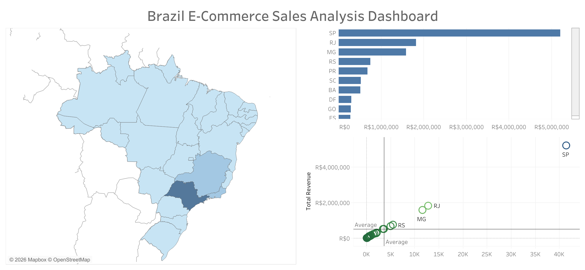

# brazil-ecommerce-sales-analysis

This project analyzes Brazilian e-commerce sales performance using SQL and Tableau.

The goal of the analysis is to understand revenue distribution across states, identify top-performing regions, and explore the relationship between order volume and total revenue.

## Tools Used
SQL (Google BigQuery)  
Tableau Public

## Dashboard

## Tableau Public Dashboard
[View Dashboard Here]((https://public.tableau.com/views/OlistE-CommerceSalesAnalysisSQLTableau/BrazilEcommerceSalesDashboard?:language=en-US&:sid=&:redirect=auth&:display_count=n&:origin=viz_share_link))

## Key Insights
* São Paulo generates the highest revenue and order volume  
* Rio de Janeiro and Minas Gerais follow as the next major contributors  
* Sales are concentrated in a few high-performing states  
* A strong relationship exists between total orders and revenue across states

## Business Recommendations
* Focus marketing investment in top-performing states like São Paulo  
* Explore growth opportunities in mid-performing regions  
* Improve marketing strategies in low-performing states to increase order volume
